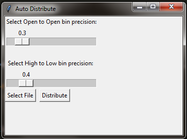
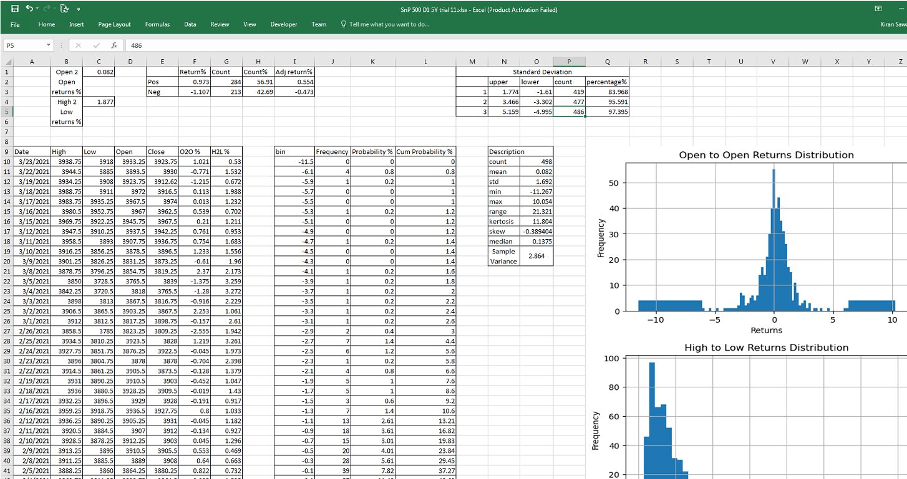
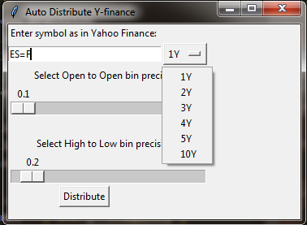

# Auto Distribute
A Python app that takes a CSV file with Date, Open, High, Low Historical data of any asset and returns an excel file with a probability distribution
of Open to Open and High to Low returns. The repo includes notebooks that shows working of all the codes in the script.

## Auto Distribute Preview

 

The above preview is of the standard version. You should first select the precision for Open to Open and High to Low bins in percentage by moving the slider.
Then press select button and select the .csv file from the file browser. After selecting file press Distribute, it will ask for a save location and file name
to saveas. Navigate to the folder you want to save, and give an appropriate name without extention. The app will return an Excel file with sheet as shown below.

 

The Sheet contains the following things.
  * A Histogram displaying the distribution of Open to Open and high to low returns.
  * A Frequency table of Open to Open and High to Low returns with probability and cumulative probability.
  * A statistical Description table for both Open to Open and High to Low.
  * Averages table for negetive and positive returns on Open to Open.
  * A standard Deviation table to analyse the standard deviation of Open to Open returns.
  * A High to Low and Open to Open perentage change column.
  
Note.
  - The sheet doesn't come decorated. You will need to take care of tabel bordering, heading and placing the histogram.
  - Histogram is rendered by matplotlib, if you do not like it, use excels histogram utility.
  - All the columns with % sign in their headers are already in percentages, you do not need to format those columns as percentages in excel.
 
## Auto Distribute Y-Finance Preview

 
The Y-Finance version of Auto Distribute utilizes Yahoo finance API to fetch historical daily price data from Yahoo finance.
Enter the symbol of the security you want a distribution of as on <a href='https://finance.yahoo.com/'>Yahoo finance</a>, in the text box.
Here, we pass the symbol for SnP500 e-mini futures. Select the time span from drop-down menu, select the precisions and press distribute.
It will ask for save location and file name and return a distribution spreadsheet as above.
  
Note.
  - You can't get weekly or monthly data through yahoofinance API, so for that use the standard version.
    
### Known bugs.
  - For larger datasets(5Years or more) the frequency counting function gets a little distorted, therefore you can get cummulative probability between 99 & 100.
  - While selecting a save location, the app will pop open Excel file even if you press cancel.
  
